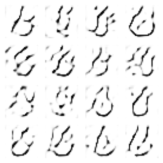
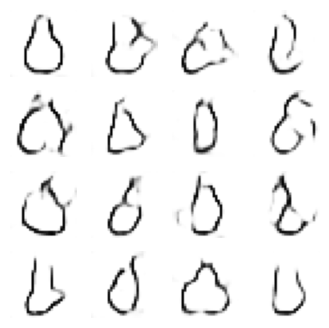
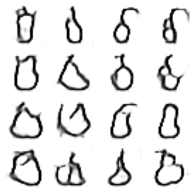
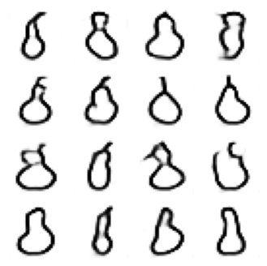
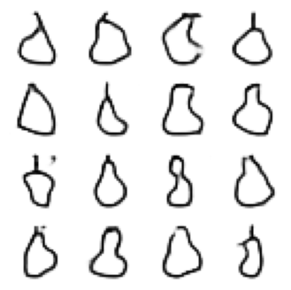
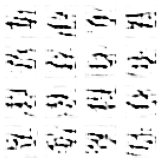
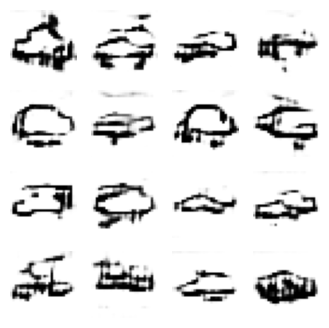
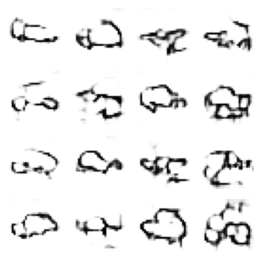
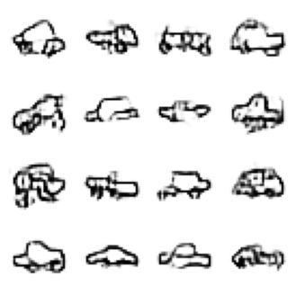
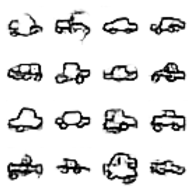

# GAN for doodle Generation

A simple **Generative Adversarial Network (GAN)** implemented in Keras that learns to generate doodle-like sketches from Google’s **QuickDraw dataset**.  

This script downloads a dataset of hand-drawn sketches (e.g., *cat*, *car*, *tree*), trains a GAN to mimic those drawings, and visualizes the generated samples during training.


---

## Features

- **Generator**:
  - Takes random noise as input and generates images.
  - Uses transposed convolutional layers to upsample the input noise into a 28x28 grayscale image.

- **Discriminator**:
  - Takes images as input and classifies them as real or fake.
  - Uses convolutional layers to extract features and make predictions.

- **Adversarial Training**:
  - The generator and discriminator are trained simultaneously.
  - The generator learns to create realistic images, while the discriminator learns to distinguish between real and fake images.

- **Image Visualization**:
  - Generated images are visualized during training to monitor progress.

---

## Model Architecture

### **Generator**
- Dense layer → reshape to 7×7×64  
- Upsampling + Conv2DTranspose layers  
- Batch normalization + ReLU activations  
- Output: 28×28 grayscale image with sigmoid activation  

### **Discriminator**
- 3 convolutional layers with dropout  
- Flatten + dense layer with sigmoid output  
- Binary cross-entropy loss  

---

## Usage

Run the script with the name of the object you want to generate.  
The object name must match one of the classes in the [QuickDraw dataset](https://github.com/googlecreativelab/quickdraw-dataset).

```bash
python3 gan.py <object_name>
```

### Example:
```bash
python3 gan.py cat
```

This will:
1. Download `cat.npy` from Google’s QuickDraw dataset.  
2. Train the GAN on the sketches of cats.  
3. Display generated cat-like doodles every few epochs.  

---

## Output

Every 400 epochs, the script shows a 4×4 grid of generated images similar to this:

```
Epoch 400/2000 - Showing generated images...
```

*(Each image represents the generator’s current understanding of the chosen object.)*

---

## Results

Below are examples of results produced by the GAN after training for 2000 epochs on the **QuickDraw** dataset.  
Each image shows the generator's progress at different training stages.

### 🍐 Generated "Pear" Sketches
<p align="center">
  <figure>
    <br/>
    <figcaption><em>400 epochs</em></figcaption>
  </figure>
  <figure>
    <br/>
    <figcaption><em>800 epochs</em></figcaption>
  </figure>
  <figure>
    <br/>
    <figcaption><em>1200 epochs</em></figcaption>
  </figure>
  <figure>
    <br/>
    <figcaption><em>1600 epochs</em></figcaption>
  </figure>
  <figure>
    <br/>
    <figcaption><em>2000 epochs</em></figcaption>
  </figure>
</p>
<p align="center"><em>Generated pear-like doodles showing progressive improvement over epochs.</em></p>

### 🚗 Generated "Car" Sketches
<p align="center">
  <figure>
    <br/>
    <figcaption><em>400 epochs</em></figcaption>
  </figure>
  <figure>
    <br/>
    <figcaption><em>800 epochs</em></figcaption>
  </figure>
  <figure>
    <br/>
    <figcaption><em>1200 epochs</em></figcaption>
  </figure>
  <figure>
    <br/>
    <figcaption><em>1600 epochs</em></figcaption>
  </figure>
  <figure>
    <br/>
    <figcaption><em>2000 epochs</em></figcaption>
  </figure>
</p>
<p align="center"><em>Generated car-like doodles showing progressive improvement over epochs.</em></p>

---

## References

- [Google QuickDraw Dataset](https://github.com/googlecreativelab/quickdraw-dataset)

---

